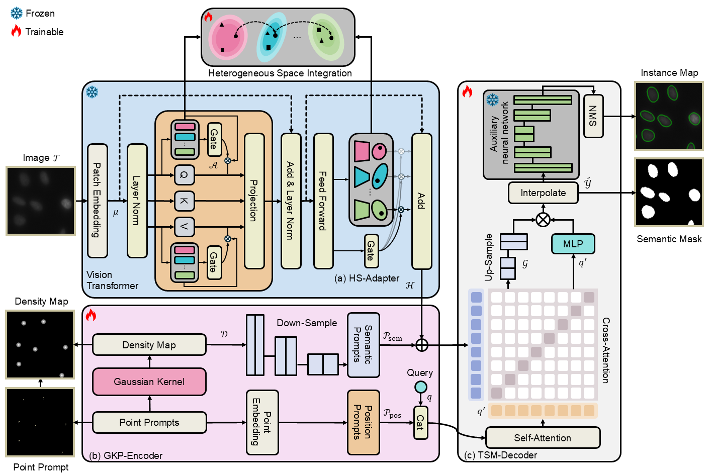

# NuSegDG: Integration of Heterogeneous Space and Gaussian Kernel for Domain-Generalized Nuclei Segmentation

:pushpin: This is an official PyTorch implementation of **NuSegDG: Integration of Heterogeneous Space and Gaussian Kernel for Domain-Generalized Nuclei Segmentation**

[[`arXiv`](https://arxiv.org/abs/2408.11787)] [[`BibTeX`](https://scholar.googleusercontent.com/scholar.bib?q=info:5dd80O9YdlwJ:scholar.google.com/&output=citation&scisdr=ClEWMSDREKieyH-ljbE:AFWwaeYAAAAAZsqjlbFJ6b4dsop8Vuw6Q8w_Dzk&scisig=AFWwaeYAAAAAZsqjlUd0m9H7J9n4zZNxl9Sj-a8&scisf=4&ct=citation&cd=-1&hl=en)]


<div align="center">
    
</div>

## 📰News

**[2024.08.21]** The pre-print paper has been uploaded!

## 🛠Setup

```bash
git clone https://github.com/xq141839/NuSegDG.git
cd NuSegDG
conda create -n NuSegDG python=3.10
conda activate NuSegDG
conda install pytorch==1.13.0 torchvision==0.14.0 torchaudio==0.13.0 pytorch-cuda=11.6 -c pytorch -c nvidia
pip install scikit-image -i https://pypi.tuna.tsinghua.edu.cn/simple
pip install albumentations==0.5.2 -i https://pypi.tuna.tsinghua.edu.cn/simple
pip install pytorch_lightning==1.1.0 -i https://pypi.tuna.tsinghua.edu.cn/simple
pip install monai -i https://pypi.tuna.tsinghua.edu.cn/simple
pip install timm -i https://pypi.tuna.tsinghua.edu.cn/simple
```


## 📚Data Preparation

The structure is as follows.
```
NuSegDG
├── datasets
│   ├── image_1024
│     ├── TCGA-21-5784-01Z-00-DX1.png
|     ├── ...
|   ├── mask_1024
│     ├── TCGA-21-5784-01Z-00-DX1.png
|     ├── ...
|   ├── DensityMap
│     ├── TCGA-21-5784-01Z-00-DX1.png
|     ├── ...
```


## 🎈Acknowledgements
Greatly appreciate the tremendous effort for the following projects!
- [SAM](https://github.com/facebookresearch/segment-anything)
- [Conv-LoRA](https://github.com/autogluon/autogluon/tree/master/examples/automm/Conv-LoRA)
